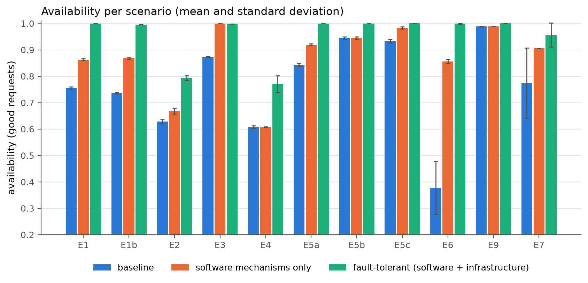

# Fault-tolerant university information system

AITU, Fault Tolerance and Reliability, midterm project.
Serikbekov Nurzhan Erlanuly (255149, CSE-2505M).

A small distributed university platform (student registration, tuition payments, academic
records and timetable generation) built twice: a baseline without fault-tolerance mechanisms
and a fault-tolerant version. Both are exposed to the same injected failures and compared by
measured reliability and availability.

Status: complete. The final dataset (141 runs, code at tag `v1.0-experiments`) is in
`results/final`, the evaluation in `results/final/analysis.json` and the figures in
`docs/figures`; the main numbers are in [Results](#results).

## Services

| Service | Responsibility | Calls |
|---|---|---|
| gateway (HAProxy) | single entry point, path routing | all services |
| student | students, course catalogue, sections, course registration | payment, timetable |
| payment | tuition invoices and payments | bank |
| records | grades, GPA, transcript documents | - |
| timetable | rooms, timeslots, timetable generation jobs | student |
| bank | simulated external payment provider with its own SQLite storage | - |
| pg-1 (PostgreSQL) | one database, one schema per service | - |
| toxiproxy | network fault injection on student -> payment, student -> timetable and payment -> bank | - |

Service-to-service calls go through the gateway; toxiproxy sits on those paths and passes
traffic unchanged until an experiment adds a fault. Every response carries an `X-Instance`
header with the container that served it.

## Run the baseline

Requires Docker with Compose v2.

```
docker compose -f docker-compose.baseline.yml up -d --build
curl localhost:8080/api/students/1
```

A one-shot `migrate` job applies the Alembic migrations and loads deterministic synthetic
data (600 students, 40 courses, 120 sections, invoices, grades and an initial timetable).
HAProxy statistics are at http://localhost:8404/stats.

Main endpoints:

| Method and path | What it does |
|---|---|
| `GET /api/students/{id}` | student profile |
| `GET /api/sections?term=2026-FALL` | sections with capacity and enrolment |
| `POST /api/registrations` | register for a section (checks tuition, schedule and seats) |
| `GET /api/tuition/{student_id}?term=2026-FALL` | tuition balance |
| `POST /api/payments` | pay tuition through the bank |
| `GET /api/transcripts/{student_id}` | grades and GPA |
| `POST /api/transcripts/{student_id}/documents` | generate and store a transcript document |
| `POST /api/timetable/generate?term=2026-FALL` | start a timetable generation job |

## Known weaknesses of the baseline

The baseline is written the way a first version often is. These weaknesses are kept on
purpose, the experiments measure them:

- no client timeouts on calls between services (the gateway gives up only after 5 minutes)
  and no statement timeouts on database queries, so a slow dependency blocks requests and
  holds database connections;
- one instance of everything and no restart policy, so any crash is an outage until a person
  restarts the container;
- a payment is recorded only after the bank charged the student, without an idempotency key:
  a crash in between loses the record, and a retry charges the student twice;
- the seat counter of a section is updated by read-modify-write, so concurrent registrations
  can overbook a section and the counter drifts;
- grade batch import commits row by row, so an interrupted import is left half done;
- timetable generation keeps its progress only in memory, and a crash leaves the job stuck
  in `RUNNING`;
- transcript files are stored once, and their hash is never checked on read.

## Software fault-tolerance mechanisms

Switched on with `UFT_FT_MODE=ft` (same code, the baseline paths stay untouched):

```
UFT_FT_MODE=ft docker compose -f docker-compose.baseline.yml up -d --build
```

| Mechanism | Where | Protects against |
|---|---|---|
| Timeouts on every call and query | `common/resilience.py` (`Dependency`), `common/db.py` | a slow dependency blocking requests |
| Retry with exponential backoff and full jitter, only for idempotent calls | `common/resilience.py` | transient network and service errors |
| Circuit breaker per dependency (5 failures open it, trial call after 5 s) | `common/resilience.py` | waiting on a dependency that is down |
| Load shedding (at most 48 requests in flight per instance, then 503) | `common/app.py` | overload turning into timeouts for everyone |
| Bulkhead: no database connection held while other services are called | `student/registration.py` | one slow dependency exhausting the pool |
| Idempotency keys and duplicate-request detection | `payment/journal.py` | double charges on client retries |
| Journal (PENDING before the bank call), roll-forward recovery worker | `payment/journal.py` | a crash between the bank charge and the record |
| Atomic, idempotent batch import (one transaction, upsert) | `records/resilient.py` | half-imported batches |
| Checkpointing and leases of timetable jobs, resume after a crash | `timetable/checkpointed.py` | lost work and jobs stuck in RUNNING |
| Recovery block (acceptance test, first-fit alternate) | `timetable/scheduler.py` | a failed or poor primary timetable |
| N-version programming: GPA by three independent versions and a majority voter | `records/gpa.py` | a design fault in one implementation |
| Graceful degradation: registrations accepted as PENDING_VERIFICATION, cached timetable, stale transcripts | `student/registration.py`, `records/resilient.py` | payment, timetable or database outages |
| Atomic seat reservation (`enrolled < capacity` in the UPDATE) | `student/registration.py` | overbooking and lost counter updates under load |
| Health endpoints with timeouts, readiness without the database for records | `common/health.py` | routing traffic to an instance that cannot serve |
| Fast 503 with Retry-After for unavailable dependencies and database | `common/app.py` | hanging requests and unclear errors |

Every mechanism logs its activity (`breaker_opened`, `retry_succeeded`, `payment_reconciled`,
`fallback_used`, `job_resumed`, ...); the experiments count these events.

## Infrastructure (hardware) fault tolerance

The fault-tolerant stack runs every service twice, on two simulated nodes:

```
docker compose -f docker-compose.ft.yml up -d --build
docker compose -f docker-compose.ft.yml --profile monitoring up -d   # plus Prometheus and Grafana
```

| Node | Containers |
|---|---|
| a | student-1, payment-1, records-1, timetable-1, pg-1 (Patroni, first primary), etcd-1 |
| b | student-2, payment-2, records-2, timetable-2, pg-2 (Patroni, synchronous standby), etcd-2 |
| c | etcd-3 (third quorum member), watchdog, backup, monitoring |
| edge | gateway (HAProxy) |

| Mechanism | How | Protects against |
|---|---|---|
| Active redundancy of services | two replicas per service behind HAProxy, round robin | the loss of one instance or one node |
| Health checks and failover at the gateway | `/health/ready` every 1 s, DOWN after 2 failures, retry and redispatch of safe requests | routing to a dead or unready replica |
| Passive (hot standby) redundancy of the database | PostgreSQL streaming replication, synchronous commit to the standby (RPO 0) | loss of the primary database |
| Leader election and automatic failover | Patroni with a 3-member etcd cluster (Raft); HAProxy routes to the node that answers `/primary` | two primaries (split brain), manual failover |
| Rejoin of the old primary | `pg_rewind` when the failed node comes back | a node that cannot return after a failover |
| Restart policy | `restart: on-failure` for every service | crashed processes |
| Watchdog | `tools/watchdog.py` restarts containers whose liveness check fails | hung processes |
| Mirrored storage with voting (RAID-1 / TMR) | three copies of every transcript file, majority read, read repair, periodic scrub | corrupted or lost files on one disk |
| Backups | `pg_dump` every 60 s, `infra/backup/restore_check.sh` measures restore time and backup age | loss of both database nodes, operator errors |
| ECC (simulated) | `lab/ecc.py`: SEC-DED (72,64) as in ECC memory, compared with parity by bit-flip injection (`python -m lab.ecc_experiment`) | bit flips in memory |

The gateway is the remaining single point of failure; in production it would be doubled with
a floating IP (keepalived) or a managed load balancer.

Monitoring: HAProxy statistics at http://localhost:8404/stats, Prometheus at
http://localhost:9090, Grafana (dashboard "University system - fault tolerance") at
http://localhost:3000.

## Experiments

The `lab` package runs controlled failure-injection experiments. The host script starts a
fresh stack for every run and then runs the experiment inside a `lab` container on the stack
network, so the load, the service logs and the Docker events share one clock.

```
python -m lab.orchestrate --mode baseline --scenarios E1,E2 --reps 5 --tag final
python -m lab.orchestrate --mode sw --scenarios E1,E2 --reps 5 --tag final   # software mechanisms only
python -m lab.orchestrate --mode ft --scenarios E1,E2 --reps 5 --tag final   # software + infrastructure
python -m lab.summarize --tag final
python -m lab.recompute --tag final     # re-evaluate stored runs after a metric change
```

Each run writes `results/<tag>/<mode>/<scenario>/rep<k>/`: every request attempt
(`requests.csv.gz`), the executed actions, Docker events, service logs, the consistency
report and `metrics.json`. `meta.json` records the git commit of the code under test.

| Scenario | Failure | How it is injected |
|---|---|---|
| E1 | application crash | the process of `payment-1` exits (137) |
| E1b | application hang | the event loop of `payment-1` blocks, the process stays alive |
| E2 | database failure | SIGKILL of the primary database |
| E3 | service-to-service timeout | toxiproxy stops answering on student -> payment |
| E4 | node failure | SIGKILL of every container of simulated node `a` |
| E5a | interrupted payment | `payment-1` crashes after the bank charge, before the payment is saved |
| E5b | interrupted grade import | `records-1` crashes half way through a 200-grade batch |
| E5c | interrupted timetable generation | `timetable-1` crashes half way through a job |
| E6 | high load | registration rush: 50 -> 300 requests per second for 60 s (baseline knee: 250-300) |
| E9 | storage corruption and disk failure | every transcript file on disk 1 corrupted, then disk 2 wiped |
| E7 | long run with random failures | 20 min; up times ~ Exp(45 s), repairs ~ Exp(30 s), failures drawn from crash, hang, database, network and node failures (seeded, the same schedule for every version) |
| CAL, CAL_RUSH | none | step load to find the capacity of the baseline (default and registration mix) |

The load is open-loop: requests start on a fixed schedule whatever the response times, so a
failing system does not reduce the offered load. The plan of requests is built up front from
a seed (the repetition number) and split between four worker processes, so the generator
keeps its schedule even when thousands of requests wait for their timeouts. The mix covers
every service; a failed payment is retried twice by the client with the same idempotency
key, like a user pressing "Pay" again. A failure is injected at 20 s. At 60 s (40 s for E5) a `repair` action restarts
whatever was killed and removes network faults, modelling an operator; both versions get the
same repair at the same time.

Metrics (definitions in `lab/metrics.py`, notation of the course lectures):

- a request is good if the system answered it without a server error within 2 s (latency
  SLO); 4xx business rejections count as answers, 5xx, 429, slow answers, timeouts (5 s) and
  connection errors do not;
- a second is unavailable when less than 95% of the requests sent in it were good; a run of
  unavailable seconds is one outage, D_i is its length;
- A = U_total / T_obs, MTTF = U_total / N, MTTR = D_total / N, MTBF = T_obs / N;
- detection time: from the injection to the first sign that the system itself noticed the
  failure (health check, circuit breaker, failover); recovery time: from the injection to the
  end of the last outage.

Consistency checks after every run compare the bank with the payment records (lost payments,
double charges, invoice balances), sections with registrations (overbooking, counter drift),
transcript files with their stored hashes, and look for half-imported grade batches and
timetable jobs stuck in `RUNNING`.

Code paths where a crash matters are marked with `fault_point(...)`; the lab arms them through
the `/_chaos` endpoint, which is mounted only when `UFT_CHAOS_ENABLED=true` and is not routed
by the gateway.

## Results

Final series: every scenario 5 times for the baseline and the fault-tolerant version and 3
times with the software mechanisms only (seeds 1-5); E7 3, 3 and 1 times. Means over the
repetitions; A is the share of good requests over the whole run (in E1-E4: failure at 20 s,
repair at 60 s, 120 s of load).

| Scenario | A baseline | A software only | A fault-tolerant | Failed requests baseline / FT | Recovery baseline / FT, s | Consistency violations baseline / FT |
|---|---|---|---|---|---|---|
| E1 application crash | 75.56% | 86.31% | 99.99% | 937 / 0.4 | 41 / 0.0 | 0.6 / 0 |
| E1b application hang | 73.64% | 86.74% | 99.59% | 1009 / 15 | 43 / 3.4 | 10 / 0 |
| E2 database failure | 62.88% | 66.85% | 79.37% | 1410 / 772 | 42 / 25.4 | 164 / 0 |
| E3 service-to-service timeout | 87.35% | 99.90% | 99.80% | 455 / 7.2 | 40 / 1.4 | 10 / 0 |
| E4 node failure | 60.72% | 60.77% | 77.06% | 1508 / 863 | 43 / 28.8 | 0 / 0 |
| E5a interrupted payment | 84.26% | 91.92% | 99.93% | 440 / 1.8 | 21 / 1.2 | 1.2 / 0 |
| E5b interrupted grade import | 94.54% | 94.47% | 99.98% | 147 / 0.6 | 21 / 0.6 | 1 / 0 |
| E5c interrupted timetable generation | 93.32% | 98.40% | 100.00% | 180 / 0 | 21 / 0.0 | 1 / 0 |
| E6 high load | 37.72% | 85.63% | 99.93% | 13079 / 15 | 81 / 0.0 | 182 / 0 |
| E9 storage corruption, disk failure | 98.85% | 98.89% | 100.00% | 34 / 0 | 88 / 0.0 | 298 / 0 |

| E7 (20 min, random failures) | Runs | Outages per run | MTTF, s | MTTR, s | MTBF, s | A (time) | A predicted from E1-E4 |
|---|---|---|---|---|---|---|---|
| baseline | 3 | 11.0 | 82.1 | 38.1 | 120.2 | 64.72% | 65.09% |
| software only | 1 | 11.0 | 84.6 | 24.5 | 109.1 | 77.58% | 77.75% |
| fault-tolerant | 3 | 8.3 | 161.0 | 6.9 | 167.9 | 94.39% | 94.78% |

What remains in the fault-tolerant version is the database failover (Patroni needs its 20 s
leader lease to expire, about 25 s in total) and the single gateway.



## Analysis

```
python -m lab.summarize --tag final     # results/final/summary.csv
python -m analysis.run --tag final      # results/final/analysis.json and docs/figures/*.png
```

`analysis/model.py` holds the reliability model (block diagrams, fault tree, sensitivity of
availability to MTBF and MTTR), `analysis/fmea.py` the FMEA table, `analysis/results.py` the
comparison, the per-failure-type breakdown of E7 and the prediction of E7 from the
single-failure scenarios, `analysis/diagrams.py` and `analysis/figures.py` the figures
(architecture, block diagrams, fault tree, timelines, capacity).

## Live demonstration

`lab/demo.py` runs one failure under load and prints, every second, the share of good
requests, which replicas answered and which database node is the primary; at the end it runs
the consistency checks.

```
docker compose -f docker-compose.ft.yml up -d --build
docker compose -f docker-compose.ft.yml run --rm lab python -m lab.demo db        # failover
docker compose -f docker-compose.ft.yml run --rm lab python -m lab.demo crash     # replica takes over
docker compose -f docker-compose.ft.yml run --rm lab python -m lab.demo payment   # crash after the bank charge
docker compose -f docker-compose.baseline.yml up -d --build
docker compose -f docker-compose.baseline.yml run --rm lab python -m lab.demo db --repair 40
```

Other failures: `hang`, `node`, `network`. After `db` or `node`, `docker compose -f
docker-compose.ft.yml up -d` brings the killed containers back (the old primary rejoins as a
standby).

## Development

```
python -m venv .venv
.venv\Scripts\activate          # Linux/macOS: source .venv/bin/activate
pip install -r requirements-dev.txt
ruff check . && ruff format --check .
pytest                                          # unit tests
UFT_BASE_URL=http://localhost:8080 pytest -m integration   # needs the running stack
```

## Repository layout

| Path | Content |
|---|---|
| `services/common` | settings, JSON logging, database session, health endpoints, app factory |
| `services/<service>` | one package per service |
| `services/tools/seed.py` | synthetic data |
| `migrations` | Alembic migrations for all schemas |
| `infra/haproxy`, `infra/toxiproxy` | gateway and network fault proxy configuration |
| `infra/patroni`, `infra/backup`, `infra/monitoring` | database cluster, backups and restore check, Prometheus and Grafana |
| `lab` | load generator, failure injection, consistency checks, metrics, scenarios, ECC simulation, live demo |
| `analysis` | reliability model, FMEA, evaluation of the results, figures |
| `results/final` | final dataset: one directory per run, `summary.csv`, `analysis.json`, `backup_check.json` |
| `docs/figures` | architecture, block diagrams, fault tree and result figures |
| `tests/unit`, `tests/integration` | unit tests and end-to-end smoke tests |
